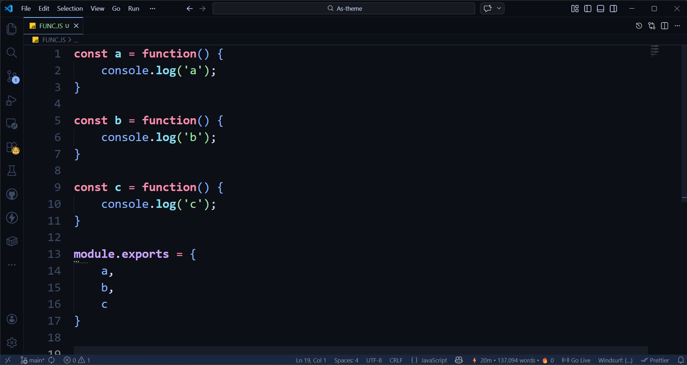

# AS Theme

**AS Theme** is a sleek, modern Visual Studio Code theme engineered for clarity, deep focus, and long coding sessions — built on a **deep-space dark palette** with warm midnight tones that are easy on the eyes and impossible to forget.

---

## ✨ Features

- **Deep navy base** (`#0C0F16`) — warm, not cold; reduces eye strain dramatically during long sessions
- **Eye-safe syntax palette** — carefully balanced colors that stay vibrant without being harsh or neon
- **10-color curated palette** — Rose · Cyan · Mint · Peach · Lavender · Cornflower · Butter · Teal · Flamingo · Soft White
- **Full language coverage** — clean syntax highlighting for all major programming languages (JS, TS, Python, Rust, Go, CSS, HTML, JSON, YAML, Shell, SQL, and more)
- **Complete UI theming** — editor, sidebar, tabs, terminal, status bar, minimap, git decorations, diff view, notebooks, and debugging UI
- **React / JSX / TSX support** — component names, props, and state styled distinctly
- **Semantic bracket colorization** — 6 distinct bracket colors for instant depth perception
- **Italic comments & decorators** — subtle style differentiation without distraction

---

## 🎨 Color Palette

| Role | Color | Hex |
|------|-------|-----|
| Editor Background | Deep Navy | `#0C0F16` |
| Keywords | Rose | `#F28FAD` |
| Functions | Sky Cyan | `#89DCEB` |
| Strings | Mint Green | `#A6E3A1` |
| Numbers | Warm Peach | `#FAB387` |
| Types / Classes | Lavender | `#CBA6F7` |
| Variables | Cornflower Blue | `#89B4FA` |
| Constants | Butter Yellow | `#F9E2AF` |
| Imports / Modules | Teal | `#94E2D5` |
| Decorators | Flamingo | `#F5C2E7` |
| Comments | Muted Gray | `#45475A` |
| Operators | Soft Pink | `#F38BA8` |

---

## 📸 Screenshots

*Showcase your theme in action — add screenshots here.*

---

## 🚀 Installation

Install **AS Theme** directly from the Visual Studio Marketplace:

1. Open **Visual Studio Code**
2. Go to **Extensions** (`Ctrl+Shift+X` or `Cmd+Shift+X`)
3. Search for `AS Theme` by `ArpitTheme`
4. Click **Install**
5. Open the **Color Theme** picker (`Ctrl+K Ctrl+T`) and select **AS Theme**

---

## 🖥️ Usage

Once installed, activate the theme via:

**Command Palette** (`Ctrl+Shift+P` or `Cmd+Shift+P`) → `Preferences: Color Theme` → select **AS Theme**

---

## 💬 Feedback & Contribution

Your feedback matters! If you encounter any issues or have suggestions, please open an issue on the [GitHub repository](https://github.com/arpitshukla9/AS-VsCode-Theme-dark).

Contributions are welcome — feel free to fork the repo and submit pull requests.

---

## 👤 About the Author

Created by **Arpit Shukla** — passionate developer and theme designer.

---

## 📄 License

This project is licensed under the **MIT License**. See the [LICENSE](LICENSE) file for details.

---

## 🔗 Resources

- [VS Code Color Theme API](https://code.visualstudio.com/api/extension-guides/color-theme)
- [Creating a VS Code Theme](https://code.visualstudio.com/api/extension-guides/color-theme#creating-a-color-theme)

---

**Happy coding with AS Theme!** 🚀